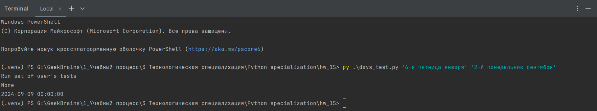
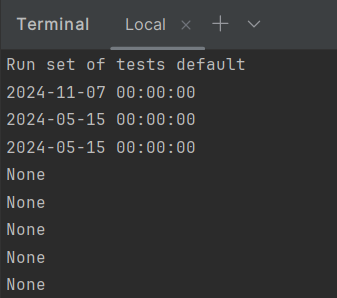
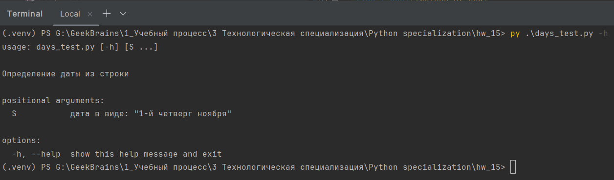
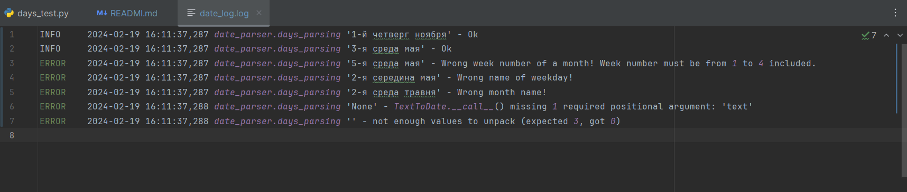
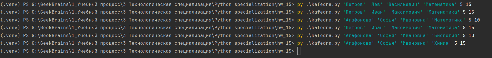
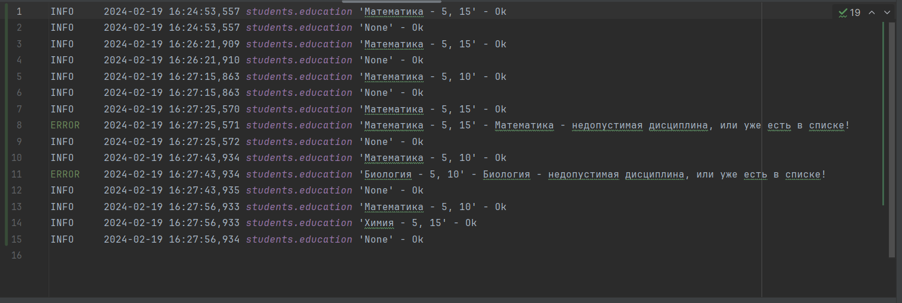
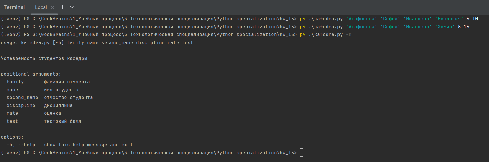

# Погружение в Python. Обзор стандартной библиотеки Python

1. Решить задания, которые не успели решить на семинаре.

2. Возьмите любые 1-3 задачи из прошлых домашних заданий.
   Добавьте к ним логирование ошибок и полезной информации.
   Также реализуйте возможность запуска из командной строки с передачей параметров.

## Задача 1

Файл: *task_1_days_test.py*

Доработка задачи с датами с семинара 15.

Функция получает на вход текст вида:

+ “1-й четверг ноября”
+ “3-я среда мая” и т.д.

Преобразуйте его в дату в текущем году. Логируйте ошибки, если текст не соответствует формату.

Работа парсера настроена на выполнение задач из командной строки, но если данные для работы
пользователем не переданы - будет выполнен разбор тестовых данных, заданный по умолчанию.

**Примеры выполнения**

Вызов из командной строки

Без передачи параметров

Вывод справки

Пример лога

## Задача 2

### Файл: *task_2_1.py*

Добавлено: логирование ошибок и полезная информация.
Реализована возможность запуска из командной строки с передачей параметров.

### Файл: *task_2_1.py*

Добавлено: логирование ошибок и полезная информация.
Реализована возможность запуска из командной строки с передачей парамет

### Файл: *task_2_3_kafedra.py*

Задача о студентах (12 семинар). Логирование операции добавления дисциплин и сохранения данных в файл.
Для логирования используется декоратор. Работа производиться ч/з командную строку.

**Пример выполнения**

Вызов программы

Лог файл

Справка

